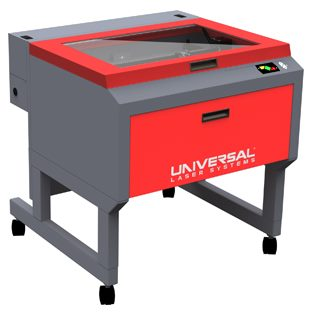

# Instructions on how to use the Laser Cutter 

(*last update : Feb 2024*)

**Location** : *Biomedtech Facilities*, prototyping platform - mechanical workshop; room : P346; 45 rue des Saints-Pères; 75006 Paris.

Find below information about the laser cutting possibilites of the Biomedtech prototyping platform and how to use it. In particular, this to-do contains practical information on how to prepare a laser cut. 

For all question and usage requests, please contact [Michael Graupner](maito:michael.graupner@u-paris.fr). 

**Content of this documentation**

[**1. Equipment and specs**](#equipment-and-specs)

[**2. How to prepare a laser cut**](#how-to-prepare-a-laser-cut)

[**3. How to perform a laser cut**](#how-to-perform-laser-cut)

-----

#### Equipment and Specs

The laser cutter model present in the platform is the **Universal Laser Systems model VLS 4.60**. 

The work surface area of this laser model is  **610 x 457 mm**and a height of **229 mm**. In turn, inital material dimensions cannot exceed those measures. 

Resources and specs of the laser cutter :   

* The library of **materials the laser can cut and engrave** :  [pdf](https://www.ulsinc.com/material/materials-library)
* The brochure of the Universal Laser Systems model VLS 4.6 model with the **system specs** : [pdf](misc/Brochure_ULS_VLS4.60.pdf)
* The **Laser Cutter Manual** : [pdf](misc/VLS460_Laser_Cutter_Manual.pdf). 
* Some information on **laser settings** for engraving and cutting for different materials : [pdf](misc/Universal-Laser-Engraver-Settings-1_13_2020.pdf).  

-----
#### How to prepare a laser cut

1. **The cut or the engraving is defined by a vector figure :** Such a figure can be generated with a vector graphic software (examples are Adobe® Illustrator®, CorelDRAW®, SOLIDWORKS, AutoCAD, Inkscape). We are using [Inkscape](https://inkscape.org/) in the lab, which is open source and versatile.   
2. **Generate a drawing which outlines your desired laser cut.** The color of the line defines the laser power setting, **red lines** (rgb 255,0,0 ; html color #ff0000ff) define default cuts. The **thickness** of the line should be set to **0.025 mm (0.001 inches)**.   **Attention :** Make sure that the outline fits the physical dimension of the to-be-cut-material. Position the drawing in the upper left corner of the drawing page. Make sure that the drawing page does not exceed the work surface area of the laser model (610 x 457 mm).  
   Here is an example drawing as [svg](misc/mirrorShape.svg) or [pdf](misc/mirrorShape.pdf) file. 
2. **Export a vector drawing as pdf file** and bring it ot the mechanical workshop on a USB stick or email the pdf to [Michael Graupner](mailto:michael.graupner@u-paris.fr). 

-----
#### How to perform laser cut

1. The account at the computer in the mechanical workshop is :  
*user* : JEGOUZODO7060\Protoypage   
*pwd* : **** (ask Michael)
2. The software controlling the laser is called **UCP**. 
3. Import the vector drawing. 
4. Make sure that the cutting setting match the material and its thickness. The software contains a library of default setting for different materials. 
5. The material-to-be-cut and the outline of the cut have to align. 
6. The play button in the upper right corner launches the cut. 
7. Attentively supervise the cuting progress. 