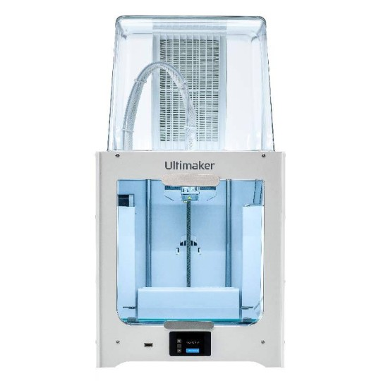

# Instructions on how to prepare your model for the Laser Cutter or 3D printer

(*last update : Feb 2024*)

**Location** : *Biomedtech Facilities*, prototyping platform - mechanical workshop; room : P346; 45 rue des Saints-Pères; 75006 Paris.

Find below information about the 3D printing and  laser cutting possibilites of the Biomedtech prototyping platform and how to use it. In particular, this site contains practical information on how to prepare your model/sketch for 3D printing/ laser cutting. Please remember that the platform is open in downgraded mode for the time until a new mechanical engineer is recruited. We are happy to provide supervised access, help and suggestions but cannot be actively involved in the conception and design of your projects. 

For all question and usage requests regaring **laser cutting**, please contact [Michael Graupner](maito:michael.graupner@u-paris.fr).  
For all question and usage requests regaring **3D printing**, please contact [Brandon Stell](maito:brandon.stell@u-paris.fr). 

**Content of this documentation**

[**1. Laser Cutter**](#1-laser-cutter)

[1.1 Equipment and specs](#11-equipment-and-specs)

[1.2 How to prepare a laser cut](#12-how-to-prepare-a-laser-cut)

[**2. 3D printer**](#2-3d-printer)

[2.1 Equipment and specs](#21-how-to-perform-laser-cut)

[2.2 How to prepare a 3D print](#22-how-to-prepare-a-3d-print)

-----

## 1. Laser Cutter
### 1.1 Equipment and Specs

The laser cutter model present in the platform is the **Universal Laser Systems model VLS 4.60**. 

The work surface area of this laser model is  **610 x 457 mm** and a height of **229 mm**. In turn, inital material dimensions cannot exceed those measures. 

Resources and specs of the laser cutter :   

* The library of **materials the laser can cut and engrave** :  [pdf](https://www.ulsinc.com/material/materials-library)
* The brochure of the Universal Laser Systems model VLS 4.6 model with the **system specs** : [pdf](misc/Brochure_ULS_VLS4.60.pdf)
* The **Laser Cutter Manual** : [pdf](misc/VLS460_Laser_Cutter_Manual.pdf). 
* Some information on **laser settings** for engraving and cutting for different materials : [pdf](misc/Universal-Laser-Engraver-Settings-1_13_2020.pdf).  

### 1.2 How to prepare a laser cut

1. **The cut or the engraving is defined by a vector figure :** Such a figure can be generated with a vector graphic software (examples are Adobe® Illustrator®, CorelDRAW®, SOLIDWORKS, AutoCAD, Inkscape). We are using [Inkscape](https://inkscape.org/) in the lab, which is open source and versatile.   
2. **Generate a drawing which outlines your desired laser cut.** The color of the line defines the laser power setting, **red lines** (rgb 255,0,0 ; html color #ff0000ff) define default cuts. The **thickness** of the line should be set to **0.025 mm (0.001 inches)**.   **Attention :** Make sure that the outline fits the physical dimension of the to-be-cut-material. Position the drawing in the upper left corner of the drawing page. Make sure that the drawing page does not exceed the work surface area of the laser model (610 x 457 mm).  
   Here is an example drawing as [svg](misc/mirrorShape.svg) or [pdf](misc/mirrorShape.pdf) file. 
3. **Export a vector drawing as pdf file** and bring it ot the mechanical workshop on a USB stick or email the pdf to [Michael Graupner](mailto:michael.graupner@u-paris.fr). 

----

## 2. 3D Printer

### 2.1 Equipment and specs

The 3D printer  model present in the platform is the **UltiMaker 2+ Connect** which is a filament based, single extrusion printer. 

Important for the conception of models is the maximal build volumne of this printer of **223 x 220 x 205 mm**. 

Resources of the 3D printer :   

* The **user manual** :  [pdf](misc/EN%20-%20Ultimaker%202%20Connect%20-%20User%20manual.pdf)

### 2.2 How to prepare a 3D print

1. **Conceive and build a 3D model :** Create a 3D model of your design using a software, taking into account the desired dimensions and specifications. Suitable 3D modeling software suites are FreeCad, Blender, Autodesk Fusion 360, or Tinkercad. We are using [FreeCad](https://www.freecad.org/) in the lab, which is open source and versatile.   
2. **Export a 3D model as stl file** and bring it ot the mechanical workshop on a USB stick or email the stl file to [Brandon Stell](mailto:brandon.stell@u-paris.fr). 

