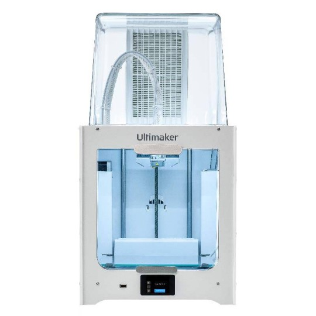

# Instructions pour préparer votre modèle pour la découpe laser ou l'impression 3D

[[English](README.md) | [French](README_fr.md)]

(*dernière mise à jour : février 2024*)

**Emplacement** : *Installations Biomedtech*, plateforme de prototypage - atelier mécanique ; salle : P346 ; 45 rue des Saints-Pères ; 75006 Paris.

Vous trouverez ci-dessous des informations sur les installations d'impression 3D et de découpe laser de la plateforme de prototypage Biomedtech et comment les utiliser. En particulier, ce site contient des informations pratiques sur comment préparer votre modèle/esquisse pour l'impression 3D/la découpe laser.

Veuillez noter que la plateforme a ouvert en mode dégradé pour le moment jusqu'à ce qu'un nouveau ingénieur mécanicien soit recruté. Nous sommes heureux de fournir un accès supervisé, de l'aide et des suggestions mais ne pouvons pas être activement impliqués dans la conception et le design de vos projets.

Pour toutes questions et demandes d'utilisation concernant **la découpe laser**, veuillez contacter [Michael Graupner](mailto:michael.graupner@u-paris.fr) avec la ligne d'objet **[demande de découpe laser]**.  
Pour toutes questions et demandes d'utilisation concernant **l'impression 3D**, veuillez contacter [Brandon Stell](mailto:brandon.stell@u-paris.fr) avec la ligne d'objet **[demande d'impression 3D]**.

**Contenu de cette documentation**

[**1. Découpe Laser**](#1-découpe-laser)

[1.1 Équipement et spécifications](#11-équipement-et-spécifications)

[1.2 Comment préparer une découpe laser](#12-comment-préparer-une-découpe-laser)

[**2. Imprimante 3D**](#2-imprimante-3d)

[2.1 Équipement et spécifications](#21-équipement-et-spécifications)

[2.2 Comment préparer une impression 3D](#22-comment-préparer-une-impression-3d)

-----

## 1. Découpe Laser

### 1.1 Équipement et Spécifications

Le modèle de découpe laser présent sur la plateforme est le **modèle Universal Laser Systems VLS 4.60**.

La surface de travail de ce modèle de laser est **610 x 457 mm** et une hauteur de **229 mm**. Ainsi, les dimensions initiales du matériel ne peuvent pas excéder ces mesures.

**Ressources et spécifications de la découpeuse laser :**  

* La bibliothèque de **matériaux que le laser peut découper et graver** : [site web](https://www.ulsinc.com/material/materials-library)
* La brochure du modèle Universal Laser Systems VLS 4.6 avec les **spécifications du système** : [pdf](misc/Brochure_ULS_VLS4.60.pdf)
* Le **Manuel de la Découpeuse Laser** : [pdf](misc/VLS460_Laser_Cutter_Manual.pdf).
* Des informations sur les **paramètres laser** pour la gravure et la découpe de différents matériaux : [pdf](misc/Universal-Laser-Engraver-Settings-1_13_2020.pdf).

### 1.2 Comment préparer une découpe laser

1. **La découpe ou la gravure est définie par une figure vectorielle :** Une telle figure peut être générée avec un logiciel de graphisme vectoriel (les exemples incluent Adobe Illustrator, CorelDRAW, SOLIDWORKS, AutoCAD, Inkscape). Nous utilisons [Inkscape](https://inkscape.org/) dans le laboratoire, qui est open source et polyvalent.   
2. **Générez un dessin qui esquisse votre découpe laser souhaitée.** La couleur de la ligne définit le réglage de la puissance du laser, les **lignes rouges** (rgb 255,0,0 ; couleur html #ff0000ff) définissent les coupes par défaut. L'**épaisseur** de la ligne doit être réglée sur **0.025 mm (0.001 pouces)**.   **Attention :** Assurez-vous que le contour correspond aux dimensions physiques du matériel à découper. Positionnez le dessin dans le coin supérieur gauche de la page. Assurez-vous que la page du dessin n'excède pas la surface de travail du modèle de laser (610 x 457 mm).  
   Voici un *exemple de dessin* en fichier [svg](misc/mirrorShape.svg) ou [pdf](misc/mirrorShape.pdf).
3. **Exportez un dessin vectoriel en fichier pdf** et apportez-le à l'atelier mécanique sur une clé USB ou envoyez le pdf à [Michael Graupner](mailto:michael.graupner@u-paris.fr) avec la ligne d'objet **[Laser Cutter Request]**.

----

## 2. Imprimante 3D

### 2.1 Équipement et Spécifications

Le modèle d'imprimante 3D présent sur la plateforme est l'**UltiMaker 2+ Connect**, qui est une imprimante basée sur le filament, avec une extrusion simple.

Important pour la conception de modèles est le volume de construction maximal de cette imprimante de **223 x 220 x 205 mm**.

Ressources de l'imprimante 3D :  

* Le **manuel de l'utilisateur** : [pdf](misc/EN-Ultimaker_2_Connect-User_manual.pdf)

### 2.2 Comment préparer une impression 3D

1. **Concevez et construisez un modèle 3D :** Créez un modèle 3D de votre conception en utilisant un logiciel, en tenant compte des dimensions et spécifications souhaitées. Les suites logicielles de modélisation 3D appropriées sont FreeCad, Blender, Autodesk Fusion 360, ou Tinkercad. Nous utilisons [FreeCad](https://www.freecad.org/) dans le laboratoire, qui est open source et polyvalent.   
2. **Exportez un modèle 3D en fichier .stl** et envoyez-le par email avec la ligne d'objet **[3D Printer Request]** à [Brandon Stell](mailto:brandon.stell@u-paris.fr).